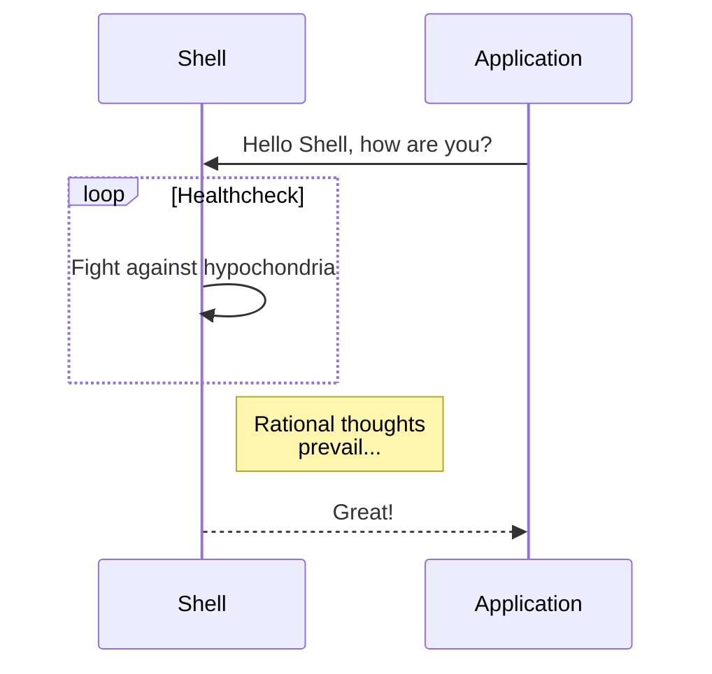
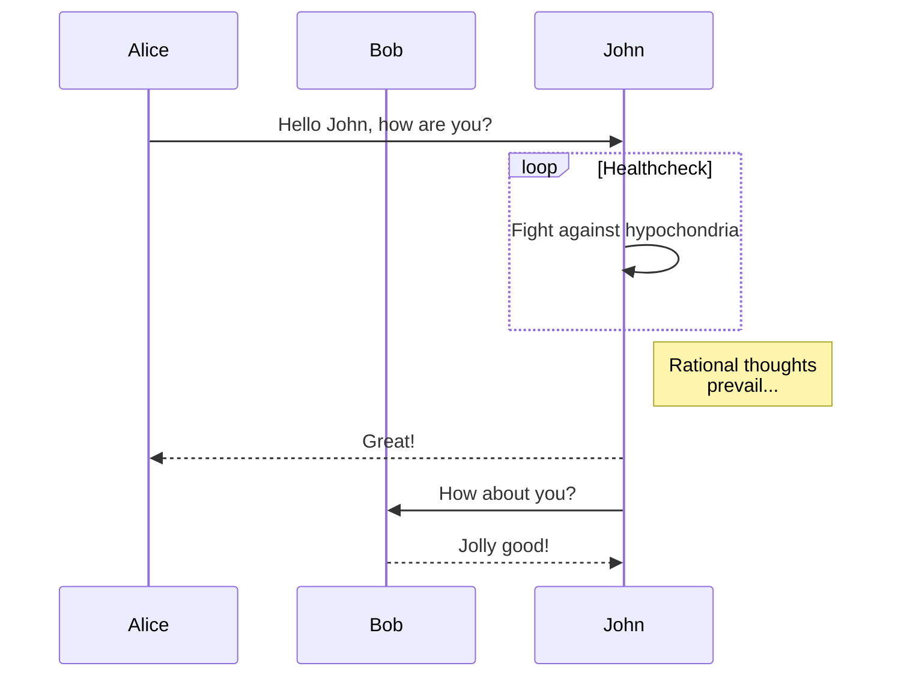

# Mermaid examples

```
graph TD;
    A-->B;
    A-->C;
    B-->D;
    C-->D;
```


---

```
sequenceDiagram
    participant Shell
    participant Application
    Application->>Shell: Hello Shell, how are you?
    loop Healthcheck
        Shell->>Shell: Fight against hypochondria
    end
    Note right of Shell: Rational thoughts<br/>prevail...
    Shell-->>Application: Great!
```



---

```
sequenceDiagram
    participant Alice
    participant Bob
    Alice->>John: Hello John, how are you?
    loop Healthcheck
        John->>John: Fight against hypochondria
    end
    Note right of John: Rational thoughts<br/>prevail...
    John-->>Alice: Great!
    John->>Bob: How about you?
    Bob-->>John: Jolly good!
```


