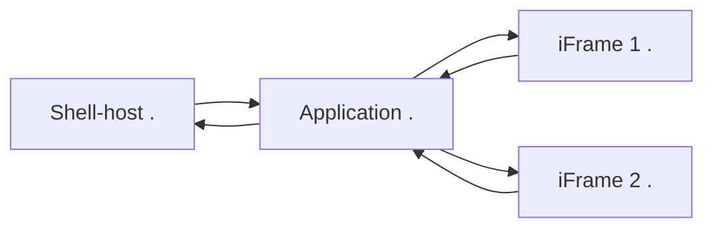
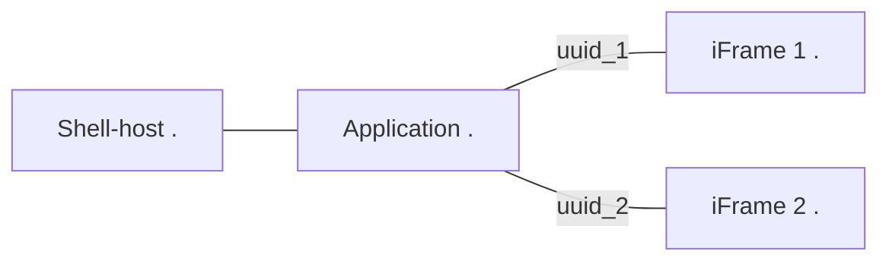
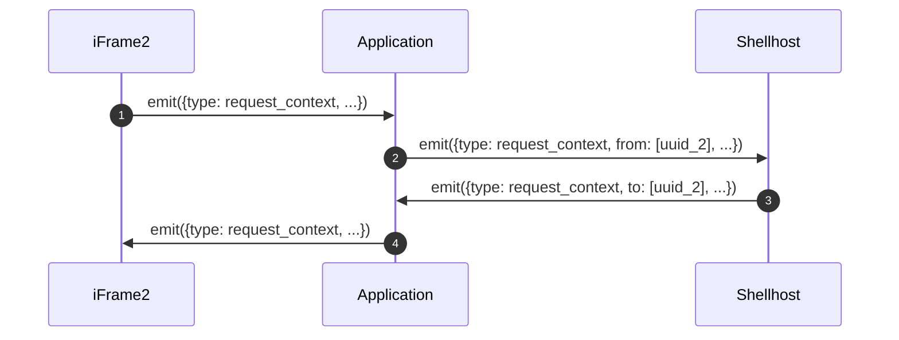
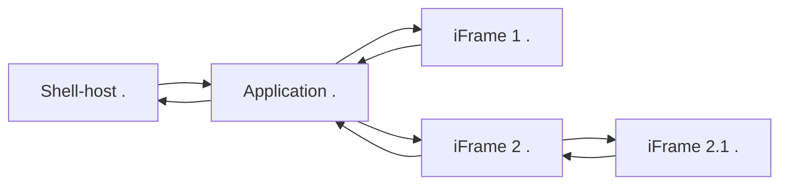
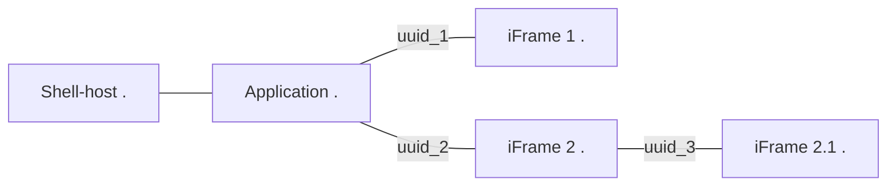
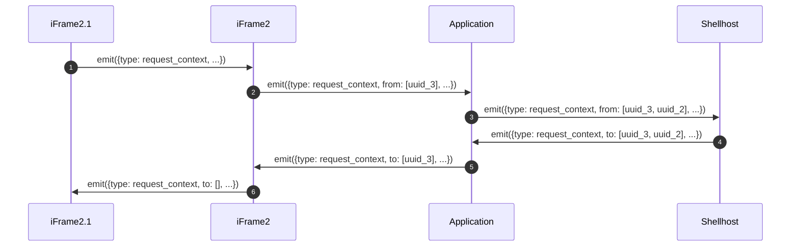
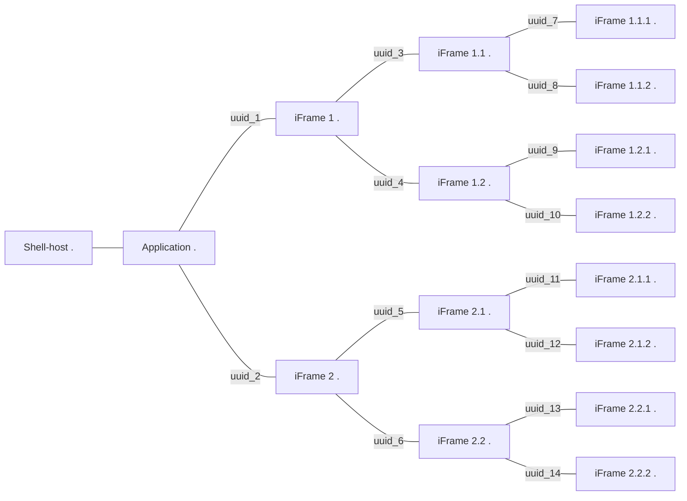

# Nested views

An application running as iframe can contain multiple iframe running independant applications. By design iframes can only communicate with its parent, or any of its child frame, building so a tree topology.

<!-- panels:start -->

<!-- div:left-panel -->

ShellSdk manage routing at each level to allow each frame to reach Shell-host individually. We can identify in this scenario three kind of nodes :

- **shell-host node**: always being root with a single children
- **application node**: always being the only direct connexion with shell-host
- **sub-application node**: any node connected at any deepth of the application node

<!-- div:right-panel -->



<!-- panels:end -->

For each node, ShellSdk **dynamically build routes** allowing to add or remove an iframes, and to use the **same syntax** to simplify development.

It use the concept of a [meshed distributed network](https://en.wikipedia.org/wiki/Mesh_networking) with each node running the exact same code, not being aware of its position or surrounding.

## Routing

When initialising a sub-application node, the hosting application need to register it to shellSdk so it build routing and recognise it as a valid route.

```javascript
// on init event
this.shellSdk.registerOutlet((frame: HTMLIFrameElement));
// on destroy event
this.shellSdk.unregisterOutlet((frame: HTMLIFrameElement));
```

Registration will assign a [`uuid v4`](https://fr.wikipedia.org/wiki/Universal_Unique_Identifier) used to identify a route, which is **not exposed** threw a public API.



A node will only handle messages if coming from its parent node or a registered outlet. When receiving a message from a registered outlet, it assign the corresponding uuid as origin and will use that exact value to answer back if needed.



## Routing algorithm

All nodes run the same code, `ShellSdk.onMessage` method define rules for each messages with different level of priority.

## Special events

### toApp

`TO_APP` is a special event directly handled if received. It will never be forwarded, meaning receiving it from a parent means it comes directly from the shell-host application. If received from a child, it is forward to the parent until the shell-host forward it back to the application.

### setViewState

`setViewState()` will send a message to the shell-host then spread it back using a [flooding technique](<https://en.wikipedia.org/wiki/Flooding_(computer_networking)>) threw the entire network with the new value.

### Example

<!-- tabs:start -->

#### ** Demo **

<iframe src="examples/selected_items/application.html" height=400></iframe>

#### ** application.html **

[Demo](/examples/selected_items/application.html ':include :type=code text')

#### ** plugin.html **

[Demo](/examples/selected_items/plugin.html ':include :type=code text')

<!-- tabs:end -->

## Nested nested views

As all node **run the same code** and **use the same syntax**, this allow an **application to be a plugin**, a **plugin to be an application**, but also a plugin to **run at any level in depth** of an application.



Each node register mounted iframes, and initialise with its parent.



Messages are routed by all nodes without knowing anything about its surrounding.



### Example

<!-- tabs:start -->

#### ** Demo **

<iframe src="examples/nested_nested/application.html?depth=3" height=600></iframe>

#### ** application.html?depth=3 **

[Demo](/examples/nested_nested/application.html ':include :type=code text')

#### ** Topology **



<!-- tabs:end -->
